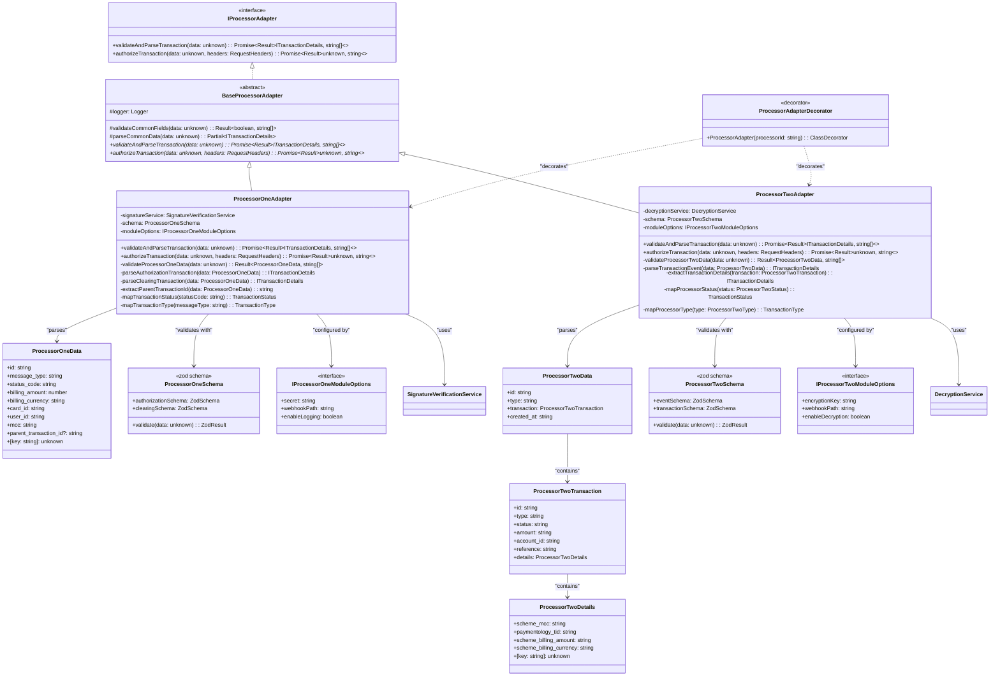

# PEMO Payment Processing System - Class Diagrams

## Core System Class Diagram

```mermaid
classDiagram
    %% Gateway Service Classes
    class GatewayController {
        -gatewayService: GatewayService
        +processWebhook(processorId: string, data: unknown, headers: RequestHeaders): Promise~any~
        +getTransactions(query: GetTransactionsQuery): Promise~TransactionResponse~
        +healthCheck(): Promise~HealthResponse~
    }

    class GatewayService {
        -adapterManager: ProcessorAdapterManager
        -transactionService: TransactionService
        +processTransaction(processorId: string, data: unknown, headers: RequestHeaders): Promise~Result~
        -validateRequest(data: unknown, headers: RequestHeaders): Result~boolean~
        -forwardToTransactionService(data: ITransactionDetails): Promise~any~
    }

    %% Transaction Service Classes
    class TransactionService {
        -transactionModel: typeof Transaction
        -transactionEventModel: typeof TransactionEvent
        -sequelize: Sequelize
        -eventEmitter: EventEmitter2
        +processAuthorizationTransaction(data: ITransactionDetails): Promise~void~
        +processClearingTransaction(data: ITransactionDetails): Promise~void~
        -createTransactionRecord(data: ITransactionDetails): Promise~Transaction~
        -updateTransactionRecord(id: string, data: Partial~ITransactionDetails~): Promise~Transaction~
    }

    class TransactionQueryService {
        -transactionModel: typeof Transaction
        +getTransactions(query: IGetTransactionsRequest): Promise~IGetTransactionResponse~
        +getTransactionById(id: string): Promise~Transaction~
        -buildWhereClause(query: IGetTransactionsRequest): WhereOptions
        -formatTransactionResponse(transactions: Transaction[]): ITransactionDetailsResponse[]
    }

    class TransactionsGrpcService {
        -queue: Queue
        -transactionQueryService: TransactionQueryService
        +processTransaction(data: ITransactionDetails): Promise~{success: boolean}~
        +getTransactions(query: IGetTransactionsRequest): Promise~IGetTransactionResponse~
        -addToQueue(data: ITransactionDetails): Promise~Job~
    }

    %% Event Handlers
    class AuthorizationEventHandler {
        -cardModel: typeof Card
        -transactionEventModel: typeof TransactionEvent
        -sequelize: Sequelize
        +handleAuthorizationEvent(transaction: Transaction): Promise~void~
        -calculateCardUtilization(transaction: Transaction, dbTransaction: DBTransaction): Promise~void~
        -sendCardholderNotification(transaction: Transaction, dbTransaction: DBTransaction): Promise~void~
    }

    class ClearingEventHandler {
        -cardModel: typeof Card
        -transactionEventModel: typeof TransactionEvent
        -sequelize: Sequelize
        +handleClearingEvent(transaction: Transaction): Promise~void~
        -updateCardUtilization(transaction: Transaction, dbTransaction: DBTransaction): Promise~void~
        -sendAnalyticsEvent(transaction: Transaction, dbTransaction: DBTransaction): Promise~void~
    }

    %% Job Processors
    class TransactionJobProcessor {
        -transactionService: TransactionService
        +processTransaction(job: Job~ITransactionDetails~): Promise~void~
        -handleJobFailure(job: Job, error: Error): Promise~void~
        -validateJobData(data: ITransactionDetails): boolean
    }

    %% Adapter Management
    class ProcessorAdapterManager {
        -adapters: Map~string, IProcessorAdapter~
        +getAdapter(processorId: string): Promise~IProcessorAdapter~
        +registerAdapter(processorId: string, adapter: IProcessorAdapter): void
        +validateProcessorData(processorId: string, data: unknown): Promise~Result~
        -loadAdapters(): void
    }

    %% Interfaces
    class IProcessorAdapter {
        <<interface>>
        +validateAndParseTransaction(data: unknown): Promise~Result~ITransactionDetails, string[]~~
        +authorizeTransaction(data: unknown, headers: RequestHeaders): Promise~Result~unknown, string~~
    }

    %% Concrete Adapters
    class ProcessorOneAdapter {
        -signatureService: SignatureVerificationService
        -schema: ZodSchema
        +validateAndParseTransaction(data: unknown): Promise~Result~ITransactionDetails, string[]~~
        +authorizeTransaction(data: unknown, headers: RequestHeaders): Promise~Result~unknown, string~~
        -validateSignature(data: string, signature: string): Promise~boolean~
        -parseProcessorOneData(data: unknown): ITransactionDetails
    }

    class ProcessorTwoAdapter {
        -decryptionService: DecryptionService
        -schema: ZodSchema
        +validateAndParseTransaction(data: unknown): Promise~Result~ITransactionDetails, string[]~~
        +authorizeTransaction(data: unknown, headers: RequestHeaders): Promise~Result~unknown, string~~
        -decryptPayload(data: string): Promise~string~
        -parseProcessorTwoData(data: unknown): ITransactionDetails
    }

    %% Shared Services
    class SignatureVerificationService {
        +verifySignature(data: string, signature: string, secret: string): Promise~boolean~
        +generateSignature(data: string, secret: string): string
        -timingSafeEqual(a: Buffer, b: Buffer): boolean
    }

    class DecryptionService {
        +decrypt(encryptedData: string, key: string): Promise~string~
        +encrypt(data: string, key: string): Promise~string~
        -validateKey(key: string): boolean
    }

    %% Relationships
    GatewayController --> GatewayService
    GatewayService --> ProcessorAdapterManager
    GatewayService --> TransactionsGrpcService
    
    TransactionsGrpcService --> TransactionQueryService
    TransactionJobProcessor --> TransactionService
    
    AuthorizationEventHandler --> Transaction
    AuthorizationEventHandler --> Card
    ClearingEventHandler --> Transaction
    ClearingEventHandler --> Card
    
    ProcessorAdapterManager --> IProcessorAdapter
    ProcessorOneAdapter ..|> IProcessorAdapter
    ProcessorTwoAdapter ..|> IProcessorAdapter
    
    ProcessorOneAdapter --> SignatureVerificationService
    ProcessorTwoAdapter --> DecryptionService
    
    TransactionService --> Transaction
    TransactionService --> TransactionEvent
    TransactionQueryService --> Transaction
```

## Data Model Class Diagram

```mermaid
classDiagram
    %% Core Models
    class Transaction {
        +id: string
        +processorId: string
        +processorName: string
        +transactionCorrelationId: string
        +authorizationTransactionId: string
        +clearingTransactionId?: string
        +status: TransactionStatus
        +type: TransactionType
        +authAmount: number
        +clearingAmount?: number
        +currency: string
        +mcc: string
        +cardId: string
        +userId: string
        +referenceNumber: string
        +metadata: unknown
        +createdAt: Date
        +updatedAt: Date
        +events: TransactionEvent[]
        +toJSON(): object
        +update(values: Partial~Transaction~): Promise~Transaction~
    }

    class Card {
        +id: string
        +cardId: string
        +userId: string
        +creditLimit: number
        +availableCredit: number
        +settledBalance: number
        +pendingBalance: number
        +currentUtilization: number
        +createdAt: Date
        +updatedAt: Date
        +calculateUtilization(): number
        +updateBalances(authAmount: number, clearingAmount?: number): void
        +isOverLimit(): boolean
    }

    class TransactionEvent {
        +id: string
        +transactionId: string
        +eventType: TransactionEventType
        +data: unknown
        +createdAt: Date
        +transaction: Transaction
        +toJSON(): object
    }

    %% Enums
    class TransactionStatus {
        <<enumeration>>
        PENDING
        SETTLED
        FAILED
        CANCELLED
    }

    class TransactionType {
        <<enumeration>>
        AUTHORIZATION
        CLEARING
    }

    class TransactionEventType {
        <<enumeration>>
        AUTHORIZATION_TRANSACTION_PROCESSED
        CLEARING_TRANSACTION_PROCESSED
        AUTHORIZATION_EVENT_HANDLED
        CLEARING_EVENT_HANDLED
        CARDHOLDER_NOTIFIED
        ANALYTICS_SENT
    }

    %% Interface Types
    class ITransactionDetails {
        <<interface>>
        +authorizationTransactionId: string
        +clearingTransactionId?: string
        +transactionCorrelationId: string
        +processorId: string
        +type: TransactionType
        +status: TransactionStatus
        +billingAmount: number
        +billingCurrency: string
        +cardId: string
        +userId: string
        +metadata: unknown
        +isSuccessful: boolean
        +processorName: string
        +mcc: string
        +referenceNumber: string
    }

    class IGetTransactionsRequest {
        <<interface>>
        +cardId?: string
        +processorId?: string
        +status?: TransactionStatus
        +page: number
        +limit: number
    }

    class IGetTransactionResponse {
        <<interface>>
        +transactions: ITransactionDetailsResponse[]
        +total: number
        +page: number
        +limit: number
    }

    class Result~T, E~ {
        <<generic>>
        +success: boolean
        +data?: T
        +error?: E
    }

    %% Relationships
    Transaction ||--o{ TransactionEvent : "has many"
    Transaction --> TransactionStatus : "uses"
    Transaction --> TransactionType : "uses"
    TransactionEvent --> TransactionEventType : "uses"
    
    Card ||--o{ Transaction : "has many transactions"
    
    ITransactionDetails --> TransactionType : "uses"
    ITransactionDetails --> TransactionStatus : "uses"
    IGetTransactionsRequest --> TransactionStatus : "uses"
```

## Processor Adapter Class Diagram



## Service Layer Class Diagram

```mermaid
classDiagram
    %% Core Service Interfaces
    class ITransactionProcessingService {
        <<interface>>
        +processAuthorizationTransaction(data: ITransactionDetails): Promise~void~
        +processClearingTransaction(data: ITransactionDetails): Promise~void~
    }

    class ITransactionQueryService {
        <<interface>>
        +getTransactions(query: IGetTransactionsRequest): Promise~IGetTransactionResponse~
        +getTransactionById(id: string): Promise~Transaction~
    }

    %% Gateway Service Layer
    class GatewayService {
        -adapterManager: ProcessorAdapterManager
        -transactionGrpcService: TransactionsGrpcService
        -logger: Logger
        +processTransaction(processorId: string, data: unknown, headers: RequestHeaders): Promise~Result~
        +getTransactions(query: IGetTransactionsRequest): Promise~IGetTransactionResponse~
        -validateProcessorId(processorId: string): boolean
        -logTransactionProcessing(processorId: string, transactionId: string): void
    }

    %% Transaction Service Layer
    class TransactionService {
        -transactionModel: typeof Transaction
        -transactionEventModel: typeof TransactionEvent
        -sequelize: Sequelize
        -eventEmitter: EventEmitter2
        -logger: Logger
        +processAuthorizationTransaction(data: ITransactionDetails): Promise~void~
        +processClearingTransaction(data: ITransactionDetails): Promise~void~
        -createTransaction(data: ITransactionDetails): Promise~Transaction~
        -updateTransaction(transaction: Transaction, data: Partial~ITransactionDetails~): Promise~Transaction~
        -createTransactionEvent(transactionId: string, eventType: TransactionEventType, data: unknown): Promise~void~
        -emitTransactionEvent(eventName: string, transaction: Transaction): void
    }

    class TransactionQueryService {
        -transactionModel: typeof Transaction
        -logger: Logger
        +getTransactions(query: IGetTransactionsRequest): Promise~IGetTransactionResponse~
        +getTransactionById(id: string): Promise~Transaction~
        -buildWhereClause(query: IGetTransactionsRequest): WhereOptions
        -calculatePagination(page: number, limit: number): {offset: number, limit: number}
        -formatTransactionResponse(transaction: Transaction): ITransactionDetailsResponse
    }

    class TransactionsGrpcService {
        -queue: Queue
        -transactionQueryService: TransactionQueryService
        -logger: Logger
        +processTransaction(data: ITransactionDetails): Promise~{success: boolean}~
        +getTransactions(query: IGetTransactionsRequest): Promise~IGetTransactionResponse~
        -addToProcessingQueue(data: ITransactionDetails): Promise~Job~
        -generateJobId(data: ITransactionDetails): string
    }

    %% Event Handler Services
    class AuthorizationEventHandler {
        -cardModel: typeof Card
        -transactionEventModel: typeof TransactionEvent
        -sequelize: Sequelize
        -logger: Logger
        +handleAuthorizationEvent(transaction: Transaction): Promise~void~
        -calculateCardUtilization(transaction: Transaction, dbTransaction: DBTransaction): Promise~void~
        -sendCardholderNotification(transaction: Transaction, dbTransaction: DBTransaction): Promise~void~
        -validateCardLimits(card: Card): void
        -logCardUtilizationUpdate(cardId: string, utilization: number): void
    }

    class ClearingEventHandler {
        -cardModel: typeof Card
        -transactionEventModel: typeof TransactionEvent
        -sequelize: Sequelize
        -logger: Logger
        +handleClearingEvent(transaction: Transaction): Promise~void~
        -updateCardUtilization(transaction: Transaction, dbTransaction: DBTransaction): Promise~void~
        -sendAnalyticsEvent(transaction: Transaction, dbTransaction: DBTransaction): Promise~void~
        -validateClearingAmount(transaction: Transaction): boolean
        -calculateNewBalances(card: Card, authAmount: number): {settledBalance: number, pendingBalance: number}
    }

    %% Queue Processing Services
    class TransactionJobProcessor {
        -transactionService: TransactionService
        -logger: Logger
        +processTransaction(job: Job~ITransactionDetails~): Promise~void~
        -handleJobSuccess(job: Job): Promise~void~
        -handleJobFailure(job: Job, error: Error): Promise~void~
        -validateJobData(data: ITransactionDetails): boolean
        -logJobProcessing(jobId: string, status: string): void
    }

    %% Utility Services
    class SignatureVerificationService {
        -logger: Logger
        +verifySignature(data: string, signature: string, secret: string): Promise~boolean~
        +generateSignature(data: string, secret: string): string
        -createHmac(algorithm: string, secret: string): crypto.Hmac
        -timingSafeEqual(a: Buffer, b: Buffer): boolean
    }

    class DecryptionService {
        -logger: Logger
        +decrypt(encryptedData: string, key: string): Promise~string~
        +encrypt(data: string, key: string): Promise~string~
        -validateEncryptionKey(key: string): boolean
        -createCipher(algorithm: string, key: string): crypto.Cipher
    }

    %% Error Handling
    class ApplicationError {
        +message: string
        +code: string
        +statusCode: number
        +timestamp: Date
        +constructor(message: string, code: string, statusCode?: number)
    }

    class TransactionError {
        +transactionId?: string
        +processorId?: string
        +constructor(message: string, transactionId?: string, processorId?: string)
    }

    class ValidationError {
        +validationErrors: string[]
        +constructor(message: string, errors: string[])
    }

    %% Relationships
    ITransactionProcessingService <|.. TransactionService
    ITransactionQueryService <|.. TransactionQueryService
    
    GatewayService --> TransactionsGrpcService
    TransactionsGrpcService --> TransactionQueryService
    TransactionJobProcessor --> TransactionService
    
    AuthorizationEventHandler --> Card
    AuthorizationEventHandler --> TransactionEvent
    ClearingEventHandler --> Card
    ClearingEventHandler --> TransactionEvent
    
    TransactionService --> Transaction
    TransactionService --> TransactionEvent
    TransactionQueryService --> Transaction
    
    ApplicationError <|-- TransactionError
    ApplicationError <|-- ValidationError
```

This comprehensive class diagram documentation provides a detailed view of the PEMO payment processing system's class structure, including:

1. **Core System Classes**: Main controllers, services, and their relationships
2. **Data Model Classes**: Database entities and their properties/methods
3. **Processor Adapter Classes**: Adapter pattern implementation for different payment processors
4. **Service Layer Classes**: Business logic services and their responsibilities

Each diagram uses Mermaid syntax for easy rendering and includes detailed class members, relationships, and inheritance hierarchies that demonstrate the system's architecture and design patterns.