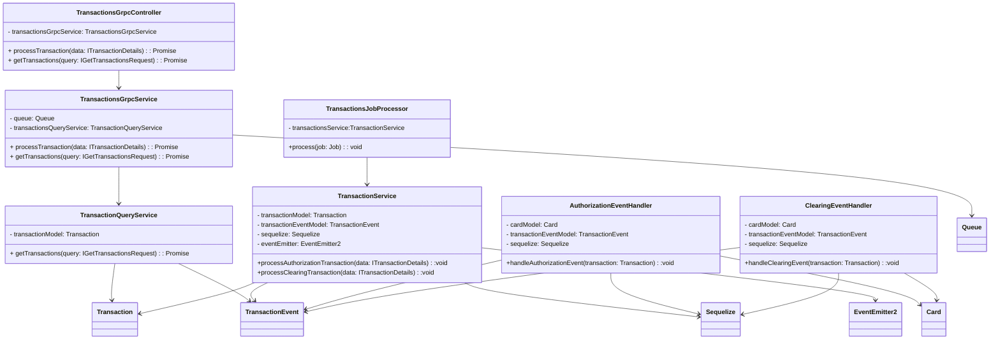

# PEMO Payment Processing System - Class Diagrams

## Gateway Service Class Diagram

```mermaid
classDiagram
direction TB
    class GatewayController {
	    -gatewayService: GatewayService
	    +handleWebhook(processorId: string, body: unknown, headers: RequestHeaders): Promise~ProcessResponse~
	    +getTransactions(query: GetTransactionsQuery) : Promise~TransactionsResponse~
    }

    class GatewayService {
	    -transactionProcessingService: TransactionProcessingService 
	    -transactionQueryService: TransactionQueryService
	    +handleWebhook(processorId: string, data: unknown, headers: RequestHeaders) : Promise~ProcessResult~
	    +getTransactions(query: GetTransactionsQuery) : Result~TransactionsResult~
    }

    class TransactionQueryService {
	    -transactionsClient: ClientGrpc
	    +getTransactions(query: GetTransactionsQuery) : Promise~TransactionsResult~
    }

    class TransactionProcessingService {
        -processorAdapterManager: ProcessorAdapterManager
        -transactionsClient: ClientGrpc
        -validateAndParseTransaction(processorId: string, body: unknown): Promise~ITransactionDetails~
        -authorizeTransaction(processorId: string, data: unknown, headers: RequestHeaders): Promise~any~
        +processTransaction(processorId: string, body: unknown, headers: RequestHeaders):Promise~ProcessResult~
    }
    
    class ProcessorAdapterManager {
	    -adapters: Map
	    +getProcessorAdapter(processorId: string) : Promise~IProcessorAdapter~
        +getProcessorAdapterOrThrow(processorId: string) : Promise~IProcessorAdapter~
	    +getProcessorIds():Promise~string[]~
        -discoverProcessorAdapters():Promise~any~
	    -validateProcessorAdapter(instance: unknown, processorId: string) : Promise~any~
	    -validateHasMethods() : void
    }

    class IProcessorAdapter {
	    +validateAndParseTransaction(data: unknown) : Promise~Result~
	    +authorizeTransaction(data: unknown, headers: RequestHeaders) : Promise~Result~
    }

    class ProcessorOneAdapter {
	    -signatureService: SignatureVerificationService
	    +validateAndParseTransaction(data: unknown) : Promise~Result~
	    +authorizeTransaction(data: unknown, headers: RequestHeaders) : Promise~Result~
    }

    class ProcessorTwoAdapter {
	    -decryptionService: DecryptionService
	    +validateAndParseTransaction(data: unknown) : Promise~Result~
	    +authorizeTransaction(data: unknown, headers: RequestHeaders) : Promise~Result~
    }

    class SignatureVerificationService {
	    +verifySignature(data: string, signature: string, publicKey: string, algorithm: string) : Promise~boolean~
    }

    class DecryptionService {
	    +privateDecrypt(encryptedData: string, privateKey: string) : Promise~string~
    }

    class ClientGrpc {

    }

   
	<<interface>> IProcessorAdapter
	<<interface>> ITransactionDetails
    
    GatewayController --> GatewayService
    GatewayService --> TransactionQueryService
    GatewayService --> TransactionProcessingService
    TransactionProcessingService --> ProcessorAdapterManager
    TransactionProcessingService --> ClientGrpc
    TransactionQueryService --> ClientGrpc
    ProcessorAdapterManager --> IProcessorAdapter
    ProcessorOneAdapter ..|> IProcessorAdapter
    ProcessorTwoAdapter ..|> IProcessorAdapter
    ProcessorOneAdapter --> SignatureVerificationService
    ProcessorTwoAdapter --> DecryptionService
    ProcessorTwoAdapter --> SignatureVerificationService
```

## Transaction Service Class Diagram



## Transaction service class diagram
This comprehensive class diagram documentation provides a detailed view of the PEMO payment processing system's class structure, including:

1. **Gateway System Classes**: Main controllers, services, and their relationships
2. **Transaction System Classes**: Main controllers, services, and their relationships