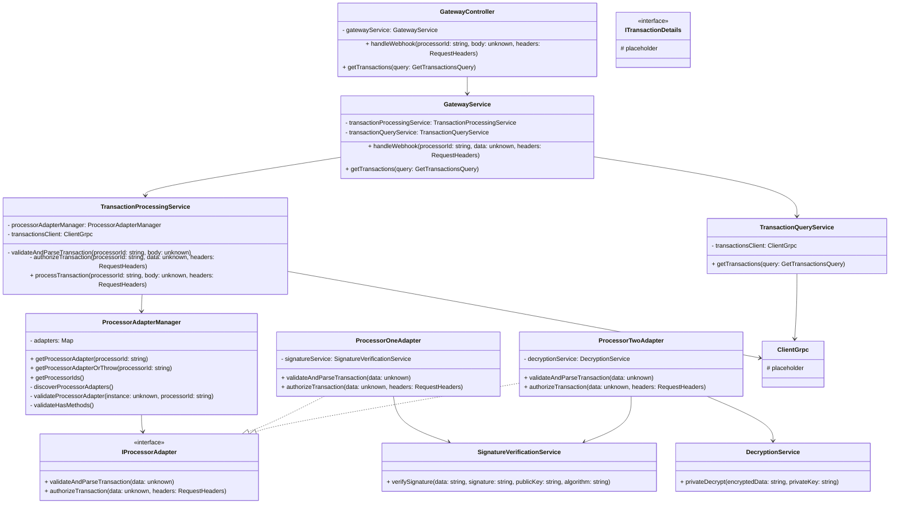

# PEMO Payment Processing System - Class Diagrams

## Gateway Service Class Diagram

## Transaction Service Class Diagram

## Transaction service class diagram
This comprehensive class diagram documentation provides a detailed view of the PEMO payment processing system's class structure, including:

1. **Gateway System Classes**: Main controllers, services, and their relationships
2. **Transaction System Classes**: Main controllers, services, and their relationships