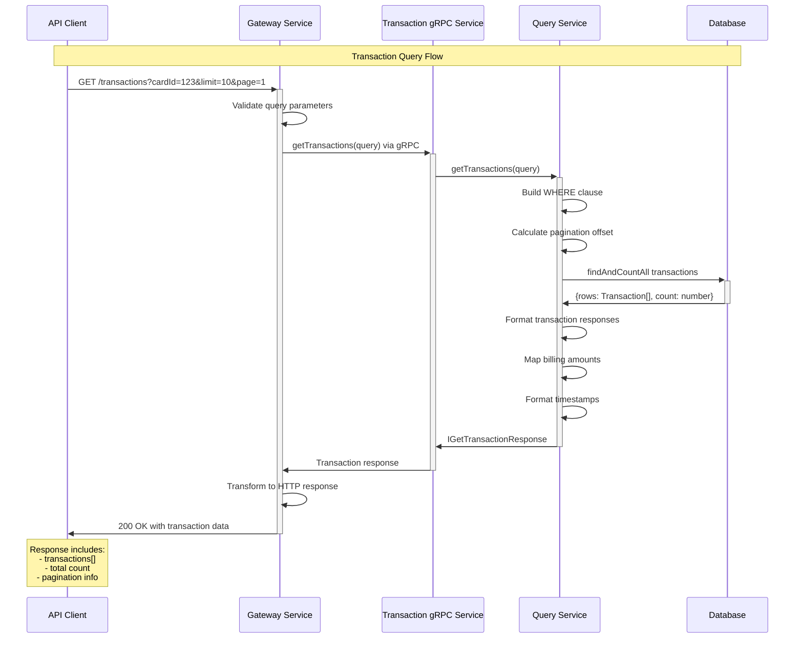
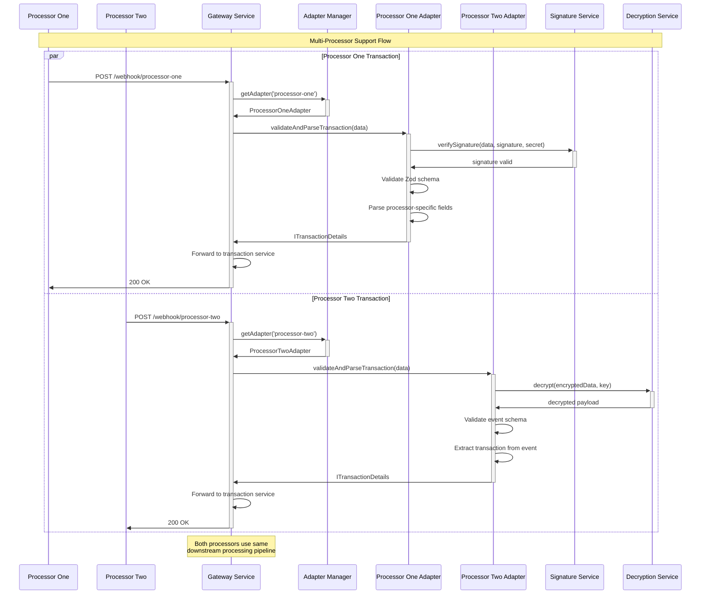
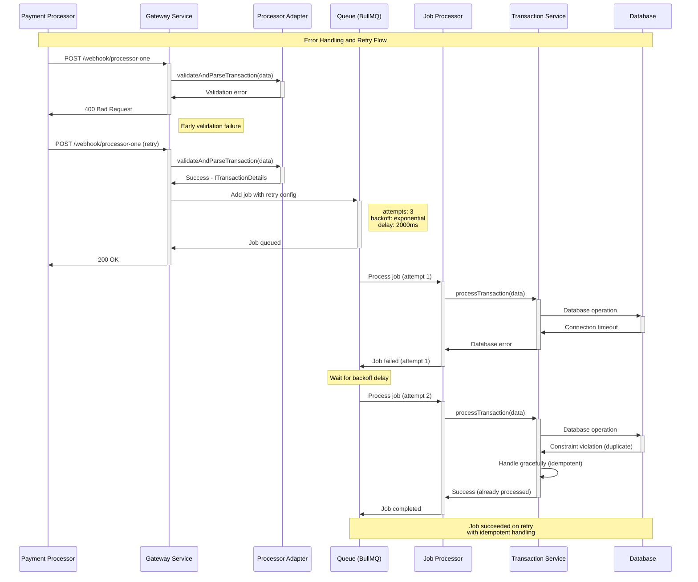
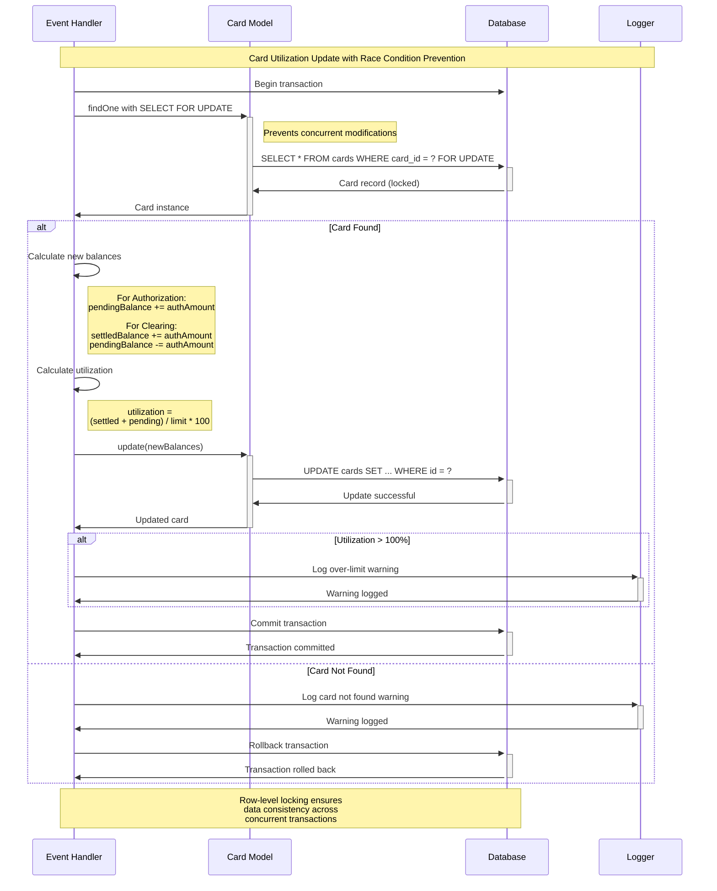
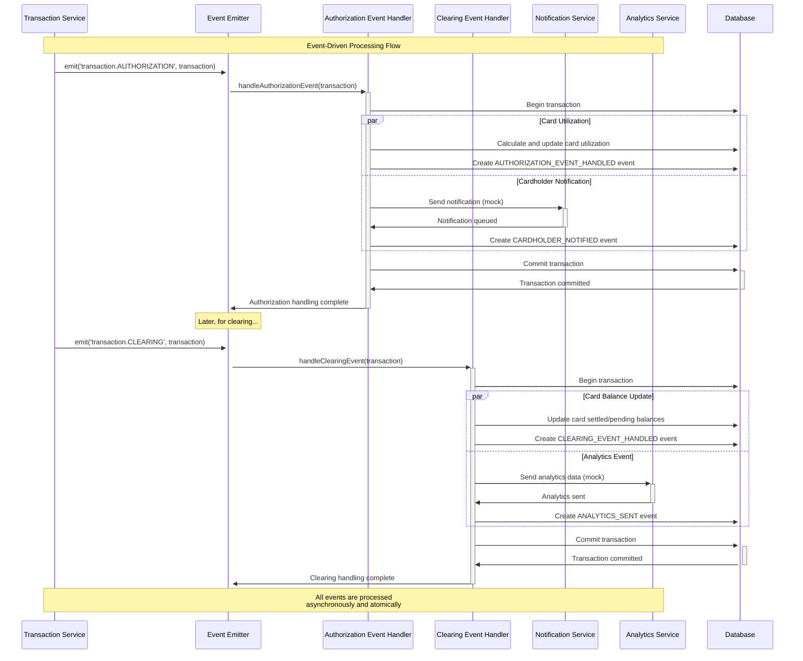
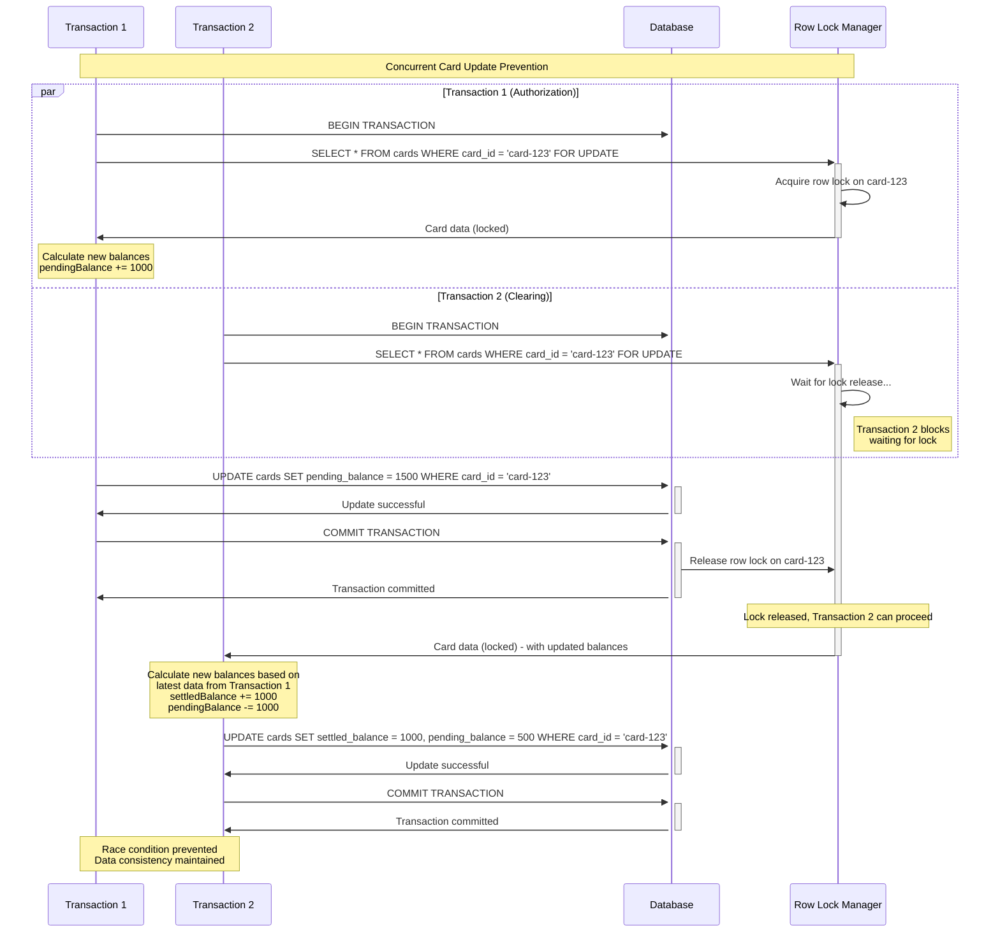

# PEMO Payment Processing System - Sequence Diagrams

## Authorization Transaction Flow

```mermaid
sequenceDiagram
    participant PP as Payment Processor
    participant GW as Gateway Service
    participant AM as Adapter Manager
    participant PA as Processor Adapter
    participant TS as Transaction Service
    participant Q as Queue (BullMQ)
    participant JP as Job Processor
    participant EH as Event Handler
    participant DB as Database
    participant Card as Card Service

    Note over PP,Card: Authorization Transaction Processing Flow

    PP->>+GW: POST /webhook/processor-one
    Note right of PP: Authorization webhook payload

    GW->>+AM: getAdapter(processorId)
    AM->>-GW: ProcessorAdapter instance

    GW->>+PA: validateAndParseTransaction(data)
    PA->>PA: Validate signature
    PA->>PA: Validate schema
    PA->>PA: Parse to ITransactionDetails
    PA->>-GW: Result<ITransactionDetails>

    alt Validation Success
        GW->>+TS: processTransaction(transactionDetails)
        TS->>+Q: Add job to queue
        Q->>-TS: Job queued successfully
        TS->>-GW: {success: true}
        GW->>-PP: 200 OK

        Note over Q,Card: Async Processing

        Q->>+JP: Process job
        JP->>+TS: processAuthorizationTransaction(data)
        
        TS->>+DB: Begin transaction
        TS->>DB: findOrCreate transaction
        TS->>DB: Create transaction event
        TS->>-DB: Commit transaction

        TS->>+EH: Emit 'transaction.AUTHORIZATION' event
        EH->>+Card: Calculate card utilization
        
        Card->>+DB: SELECT FOR UPDATE card
        Card->>DB: Update card balances
        Card->>-DB: Commit card update

        EH->>DB: Create AUTHORIZATION_EVENT_HANDLED event
        EH->>DB: Create CARDHOLDER_NOTIFIED event
        EH->>-TS: Event processing complete

        TS->>-JP: Transaction processed
        JP->>-Q: Job completed

    else Validation Failed
        GW->>-PP: 400 Bad Request
        Note right of GW: Validation errors returned
    end
```

## Clearing Transaction Flow

```mermaid
sequenceDiagram
    participant PP as Payment Processor
    participant GW as Gateway Service
    participant AM as Adapter Manager
    participant PA as Processor Adapter
    participant TS as Transaction Service
    participant Q as Queue (BullMQ)
    participant JP as Job Processor
    participant EH as Event Handler
    participant DB as Database
    participant Card as Card Service

    Note over PP,Card: Clearing Transaction Processing Flow

    PP->>+GW: POST /webhook/processor-one
    Note right of PP: Clearing webhook payload

    GW->>+AM: getAdapter(processorId)
    AM->>-GW: ProcessorAdapter instance

    GW->>+PA: validateAndParseTransaction(data)
    PA->>PA: Validate signature
    PA->>PA: Parse clearing data
    PA->>PA: Extract parent transaction ID
    PA->>-GW: Result<ITransactionDetails>

    alt Validation Success
        GW->>+TS: processTransaction(transactionDetails)
        TS->>+Q: Add clearing job to queue
        Q->>-TS: Job queued successfully
        TS->>-GW: {success: true}
        GW->>-PP: 200 OK

        Note over Q,Card: Async Clearing Processing

        Q->>+JP: Process clearing job
        JP->>+TS: processClearingTransaction(data)
        
        TS->>+DB: Begin transaction
        TS->>DB: Find pending transaction (SELECT FOR UPDATE)
        
        alt Transaction Found
            TS->>DB: Update transaction with clearing data
            TS->>DB: Create clearing event
            TS->>-DB: Commit transaction

            TS->>+EH: Emit 'transaction.CLEARING' event
            EH->>+Card: Update card utilization
            
            Card->>+DB: SELECT FOR UPDATE card
            Card->>Card: Calculate new balances
            Note right of Card: settled_balance += auth_amount<br/>pending_balance -= auth_amount
            Card->>DB: Update card balances
            Card->>-DB: Commit card update

            EH->>DB: Create CLEARING_EVENT_HANDLED event
            EH->>DB: Create ANALYTICS_SENT event
            EH->>-TS: Clearing processing complete

        else Transaction Not Found
            TS->>DB: Rollback transaction
            TS->>-EH: Log error and handle gracefully
        end

        TS->>-JP: Clearing processed
        JP->>-Q: Job completed

    else Validation Failed
        GW->>-PP: 400 Bad Request
    end
```

## Transaction Query Flow



## Multi-Processor Adapter Flow



## Error Handling and Retry Flow



## Card Utilization Update Flow



## Event-Driven Processing Flow



## System Health Check Flow

```mermaid
sequenceDiagram
    participant LB as Load Balancer
    participant GW as Gateway Service
    participant TS as Transaction Service
    participant DB as Database
    participant Redis as Redis Queue

    Note over LB,Redis: System Health Check Flow

    LB->>+GW: GET /health
    
    par Gateway Health Check
        GW->>GW: Check service status
        GW->>+TS: Health check via gRPC
        TS->>TS: Check service status
        TS->>+DB: SELECT 1 (DB health)
        DB->>-TS: DB responsive
        TS->>+Redis: Ping (Queue health)
        Redis->>-TS: Queue responsive
        TS->>-GW: {status: 'healthy', services: {...}}
    end
    
    GW->>GW: Aggregate health status
    GW->>-LB: 200 OK {status: 'healthy'}

    Note over LB: Load balancer routes traffic<br/>based on health status

    alt Unhealthy Service
        GW->>+TS: Health check via gRPC
        TS->>+DB: SELECT 1
        DB-->>-TS: Connection timeout
        TS->>-GW: {status: 'unhealthy', error: 'DB_TIMEOUT'}
        GW->>-LB: 503 Service Unavailable
        
        Note over LB: Load balancer removes<br/>unhealthy instance from pool
    end
```

## Database Transaction Isolation Flow



This comprehensive sequence diagram documentation illustrates the key workflows and interactions within the PEMO payment processing system, covering:

1. **Authorization Transaction Flow**: Complete webhook processing to database persistence
2. **Clearing Transaction Flow**: Settlement processing and card balance updates
3. **Transaction Query Flow**: API querying with pagination
4. **Multi-Processor Flow**: Adapter pattern implementation for different processors
5. **Error Handling**: Retry mechanisms and graceful error handling
6. **Card Utilization**: Race condition prevention with database locking
7. **Event-Driven Processing**: Asynchronous event handling
8. **Health Checks**: System monitoring and load balancer integration
9. **Database Isolation**: Concurrent transaction safety

Each diagram demonstrates the system's robust architecture, error handling, and data consistency mechanisms.