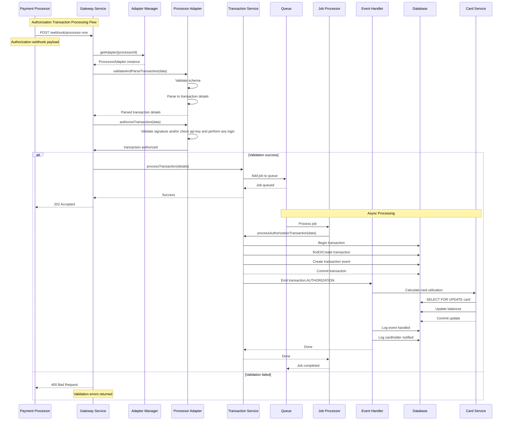
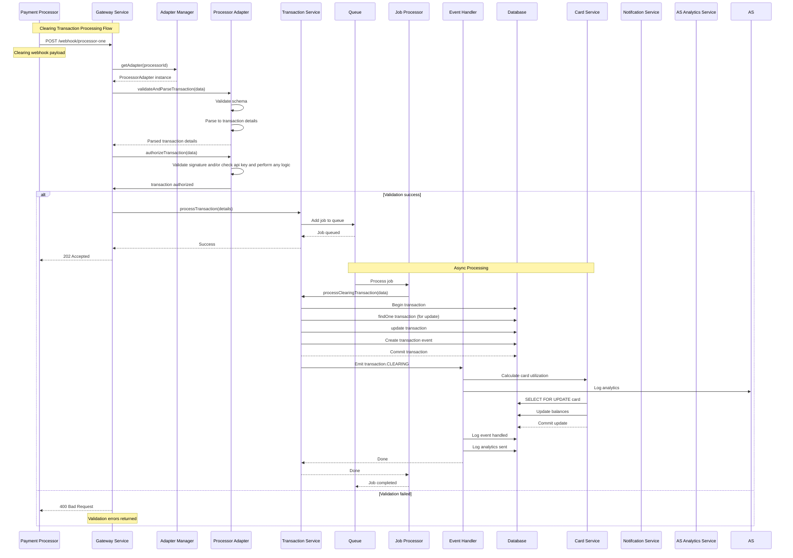
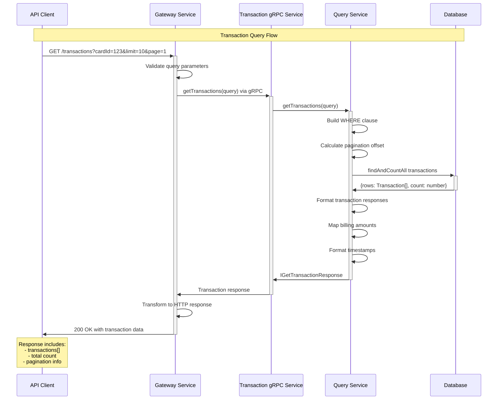
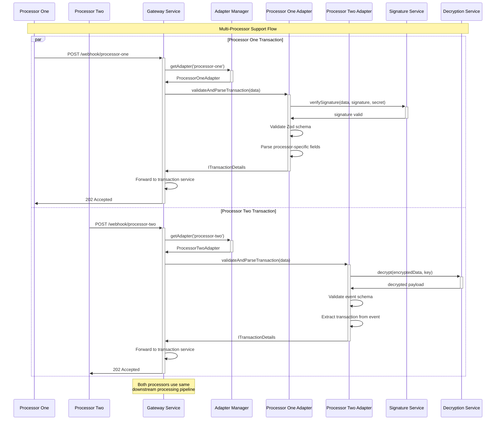
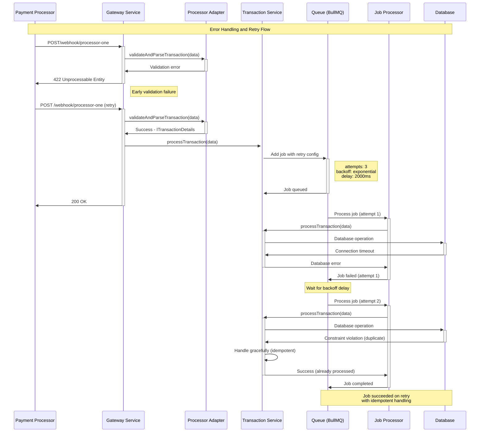
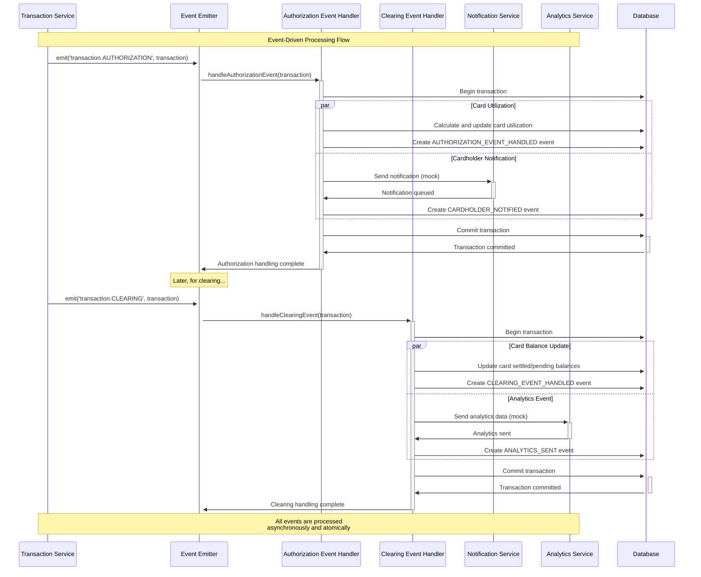

# PEMO Processing System - Sequence Diagrams

## Authorization Transaction Flow

## Clearing Transaction Flow

## Transaction Query Flow

## Multi-Processor Adapter Flow

## Error Handling and Retry Flow

## Event-Driven Processing Flow

---
This sequence diagram documentation illustrates the key workflows and interactions within the PEMO  processing system, covering:

1. **Authorization Transaction Flow**: Complete webhook processing to database persistence
2. **Clearing Transaction Flow**: Settlement processing and card balance updates
3. **Transaction Query Flow**: API querying with pagination
4. **Multi-Processor Flow**: Adapter pattern implementation for different processors
5. **Error Handling**: Retry mechanisms and graceful error handling
6. **Event-Driven Processing**: Asynchronous event handling

Each diagram demonstrates the system's robust architecture, error handling, and data consistency mechanisms.